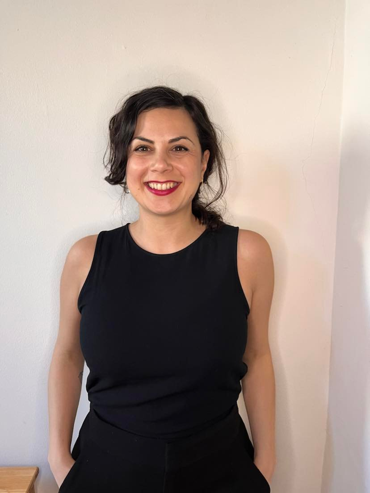

## Welcome to my website!

[Home](./)  [Research](./research.md)   [My CV](./cv.md)   [My other stuff](./myotherstuff.md)   [Contact](./contact.md) 

### A little about myself

I am a curious person by nature, always seeking to answer questions. During my undergraduate studies I crashed on my first course in evolution, and it was love at first sight! Ever since a fascinating journey on science has started for me, and driven me from Greece to Italy, France, Serbia, and lately, the US. 

My expertise lies in molecular evolution and phylogenetics, molecular ecology, biogeography, cancer metastasis and bioinformatics.

